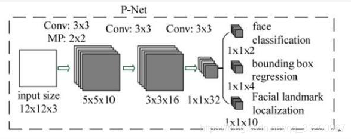
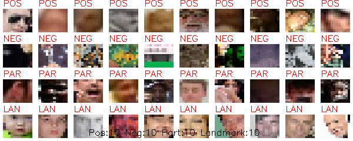
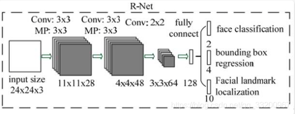
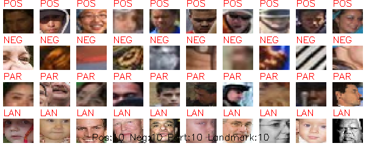
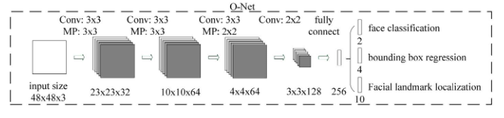
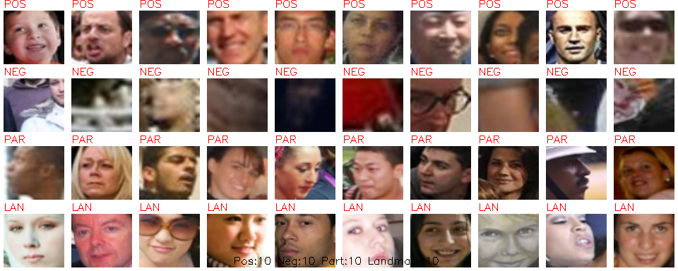
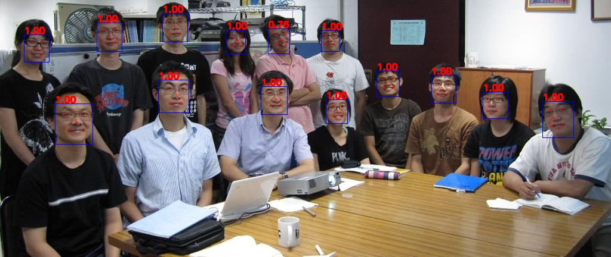

# 前言

MTCNN，Multi-task convolutional neural network（多任务卷积神经网络），将人脸区域检测与人脸关键点检测放在了一起，总体可分为P-Net、R-Net、和O-Net三层网络结构。它是2016年中国科学院深圳研究院提出的用于人脸检测任务的多任务神经网络模型，该模型主要采用了三个级联的网络，采用候选框加分类器的思想，进行快速高效的人脸检测。这三个级联的网络分别是快速生成候选窗口的P-Net、进行高精度候选窗口过滤选择的R-Net和生成最终边界框与人脸关键点的O-Net。和很多处理图像问题的卷积神经网络模型，该模型也用到了图像金字塔、边框回归、非最大值抑制等技术。

# 环境

- Pytorch 2.11.0
- Python 3.11

# 安装依赖

1. 安装Pytorch。

```
pip3 install torch torchvision --index-url https://download.pytorch.org/whl/cu130
```

1. 安装其他依赖。

```
pip3 install -r requirements.txt
```

# 文件介绍

- `models/Loss.py` MTCNN所使用的损失函数，包括分类损失函数、人脸框损失函数、关键点损失函数
- `models/PNet.py` PNet网络结构
- `models/RNet.py` RNet网络结构
- `models/ONet.py` ONet网络结构
- `utils/data_format_converter.py` 把大量的图片合并成一个文件
- `utils/data.py` 训练数据读取器
- `utils/utils.py` 各种工具函数
- `train_PNet/generate_PNet_data.py` 生成PNet训练的数据
- `train_PNet/show_PNet_data.py` 显示PNet模型训练数据的预览
- `train_PNet/train_PNet.py` 训练PNet网络模型
- `train_RNet/generate_RNet_data.py` 生成RNet训练的数据
- `train_RNet/show_RNet_data.py` 显示RNet模型训练数据的预览
- `train_RNet/train_RNet.py` 训练RNet网络模型
- `train_ONet/generate_ONet_data.py` 生成ONet训练的数据
- `train_ONet/show_ONet_data.py` 显示ONet模型训练数据的预览
- `train_ONet/train_ONet.py` 训练ONet网络模型
- `infer_path.py` 使用路径预测图像，检测图片上人脸的位置和关键的位置，并显示
- `infer_camera.py` 预测图像程序，检测图片上人脸的位置和关键的位置实时显示

# 数据集下载

- [WIDER Face](http://mmlab.ie.cuhk.edu.hk/projects/WIDERFace/) 下载训练数据WIDER Face Training Images，解压的WIDER\_train文件夹放置到dataset下。
- [Deep Convolutional Network Cascade for Facial Point Detection](http://mmlab.ie.cuhk.edu.hk/archive/CNN_FacePoint.htm) 。下载 Training set 并解压，将里面的 lfw\_5590 和 net\_7876 文件夹放置到dataset下
- 解压数据集之后，`dataset`目录下应该有文件夹`lfw_5590`，`net_7876`，`WIDER_train`，有标注文件`testImageList.txt`，`trainImageList.txt`，`wider_face_train.txt`

# 训练模型

训练模型一共分为三步，分别是训练PNet模型、训练RNet模型、训练ONet模型，每一步训练都依赖上一步的结果。

## 第一步 训练PNet模型

PNet全称为Proposal Network，其基本的构造是一个全卷积网络，P-Net是一个人脸区域的区域建议网络，该网络的将特征输入结果三个卷积层之后，通过一个人脸分类器判断该区域是否是人脸，同时使用边框回归。



1. `cd train_PNet` 切换到`train_PNet`文件夹
2. `python3 generate_PNet_data.py` 首先需要生成PNet模型训练所需要的图像数据，生成的图片大小为12\*12，有四中类型，一个是包含完整人脸的图片，一个是包含部分人脸的图片，一个是没有包含人脸的图片，一个是包含人脸的4个关键点的图片。

输出日志：

```Shell
开始生成bbox图像数据
总共的图片数： 12880
生成12x12 bbox样本: 100%|██████████████████████████████████████████████| 202/202 [00:42<00:00,  4.76it/s]
12880 个图片已处理，pos：301488  part: 1253745 neg:1040290
开始生成landmark图像数据
100%|██████████████████████████████████████████████| 10000/10000 [00:52<00:00, 189.15it/s]
开始直接生成PNet数据集
整理前的数据：neg数量：1040290 pos数量：301488 part数量:1253745 landmark: 178334 基数:301000
整理后的数据：neg数量：903000 pos数量：301000 part数量:301000 landmark数量：602000
训练数据大小： 2107000
100%|██████████████████████████████████████████████| 2107000/2107000 [00:24<00:00, 87472.24it/s]
```

3. `python3 show_PNet_data.py` 显示PNet模型训练数据的预览，会显示上面制作的四种图片，每种随机显示10张。

显示的图片如下：



4. `python3 train_PNet.py` 开始训练PNet模型

输出日志：

```Shell
----------------------------------------------------------------
        Layer (type)               Output Shape         Param #
================================================================
            Conv2d-1           [-1, 10, 10, 10]             280
             PReLU-2           [-1, 10, 10, 10]               1
         MaxPool2d-3             [-1, 10, 5, 5]               0
            Conv2d-4             [-1, 16, 3, 3]           1,456
             PReLU-5             [-1, 16, 3, 3]               1
            Conv2d-6             [-1, 32, 1, 1]           4,640
             PReLU-7             [-1, 32, 1, 1]               1
            Conv2d-8              [-1, 2, 1, 1]              66
            Conv2d-9              [-1, 4, 1, 1]             132
           Conv2d-10             [-1, 10, 1, 1]             330
================================================================
Total params: 6,907
Trainable params: 6,907
Non-trainable params: 0
----------------------------------------------------------------
Input size (MB): 0.00
Forward/backward pass size (MB): 0.02
Params size (MB): 0.03
Estimated Total Size (MB): 0.05
----------------------------------------------------------------
正在加载数据标签...
数据加载完成，总数据量为：3192000
2026-05-03 13:20:25.609030 Train Epoch 0/30, Batch 0/8313, total_loss: 4.5078, cls_loss: 1.2986, box_loss: 1.1737, landmarks_loss: 5.2447, accuracy: 0.3551, eta: 71:02:31       
2026-05-03 13:20:36.621503 Train Epoch 0/30, Batch 100/8313, total_loss: 0.7694, cls_loss: 0.6060, box_loss: 0.1123, landmarks_loss: 0.2145, accuracy: 0.7644, eta: 08:15:12     
2026-05-03 13:20:40.952439 Train Epoch 0/30, Batch 200/8313, total_loss: 0.5973, cls_loss: 0.4731, box_loss: 0.1091, landmarks_loss: 0.1393, accuracy: 0.8246, eta: 05:38:13     
2026-05-03 13:20:45.979898 Train Epoch 0/30, Batch 300/8313, total_loss: 0.5192, cls_loss: 0.4147, box_loss: 0.0826, landmarks_loss: 0.1264, accuracy: 0.8761, eta: 04:55:06     
2026-05-03 13:20:50.546497 Train Epoch 0/30, Batch 400/8313, total_loss: 0.4827, cls_loss: 0.3843, box_loss: 0.0840, landmarks_loss: 0.1129, accuracy: 0.8553, eta: 04:28:40     
2026-05-03 13:20:52.464746 Train Epoch 0/30, Batch 500/8313, total_loss: 0.4699, cls_loss: 0.3767, box_loss: 0.0832, landmarks_loss: 0.1033, accuracy: 0.8744, eta: 03:50:50     
2026-05-03 13:20:54.276044 Train Epoch 0/30, Batch 600/8313, total_loss: 0.4152, cls_loss: 0.3366, box_loss: 0.0779, landmarks_loss: 0.0794, accuracy: 0.9126, eta: 03:24:51     
2026-05-03 13:20:59.094450 Train Epoch 0/30, Batch 700/8313, total_loss: 0.4507, cls_loss: 0.3807, box_loss: 0.0586, landmarks_loss: 0.0814, accuracy: 0.9118, eta: 03:24:03 
......
```


## 第二步 训练RNet模型

全称为Refine Network，其基本的构造是一个卷积神经网络，相对于第一层的P-Net来说，增加了一个全连接层，因此对于输入数据的筛选会更加严格。在图片经过P-Net后，会留下许多预测窗口，我们将所有的预测窗口送入R-Net，这个网络会滤除大量效果比较差的候选框，最后对选定的候选框进行Bounding-Box Regression和NMS进一步优化预测结果。



1. `cd train_RNet` 切换到`train_RNet`文件夹
2. `python3 generate_RNet_data.py` 使用上一步训练好的PNet模型生成RNet训练所需的图像数据，生成的图片大小为12\*12，有四中类型，一个是包含完整人脸的图片，一个是包含部分人脸的图片，一个是没有包含人脸的图片，一个是包含人脸的4个关键点的图片。

输出日志：

```Shell
开始生成bbox图像数据
100%|███████████████████████████████████████████████████████| 12880/12880 [50:34<00:00,  4.24it/s]
100%|███████████████████████████████████████████████████████| 12880/12880 [01:16<00:00, 168.68it/s]
开始生成landmark图像数据
100%|███████████████████████████████████████████████████████| 10000/10000 [00:47<00:00, 209.00it/s]
开始直接生成RNet数据集
整理前的数据：neg数量：104289 pos数量：147016 part数量:103696 landmark: 180033 基数:147000
整理后的数据：neg数量：441000 pos数量：147000 part数量:147000 landmark数量：294000
训练数据大小： 1029000
100%|███████████████████████████████████████████████████████| 1029000/1029000 [00:32<00:00, 31959.26it/s]
```

3. `python3 show_RNet_data.py` 显示RNet模型训练数据的预览，会显示上面制作的四种图片，每种随机显示10张。

显示的图片如下：



4. `python3 train_RNet.py` 开始训练RNet模型

输出日志：

```Shell
......
----------------------------------------------------------------
        Layer (type)               Output Shape         Param #
================================================================
            Conv2d-1           [-1, 28, 22, 22]             784
             PReLU-2           [-1, 28, 22, 22]               1
         MaxPool2d-3           [-1, 28, 11, 11]               0
            Conv2d-4             [-1, 48, 9, 9]          12,144
             PReLU-5             [-1, 48, 9, 9]               1
         MaxPool2d-6             [-1, 48, 4, 4]               0
            Conv2d-7             [-1, 64, 3, 3]          12,352
             PReLU-8             [-1, 64, 3, 3]               1
           Flatten-9                  [-1, 576]               0
           Linear-10                  [-1, 128]          73,856
           Linear-11                    [-1, 2]             258
           Linear-12                    [-1, 4]             516
           Linear-13                   [-1, 10]           1,290
================================================================
Total params: 101,203
Trainable params: 101,203
Non-trainable params: 0
----------------------------------------------------------------
Input size (MB): 0.01
Forward/backward pass size (MB): 0.31
Params size (MB): 0.39
Estimated Total Size (MB): 0.70
----------------------------------------------------------------
正在加载数据标签...
2026-05-03 13:16:55.066344 Train Epoch 0/22, Batch 1100/8477, total_loss: 0.3578, cls_loss: 0.3128, box_loss: 0.0619, landmarks_loss: 0.0279, accuracy: 0.9204, eta: 03:56:04    
2026-05-03 13:17:00.183677 Train Epoch 0/22, Batch 1200/8477, total_loss: 0.3252, cls_loss: 0.2763, box_loss: 0.0655, landmarks_loss: 0.0323, accuracy: 0.9160, eta: 03:49:27    
2026-05-03 13:17:03.363704 Train Epoch 0/22, Batch 1300/8477, total_loss: 0.3432, cls_loss: 0.3050, box_loss: 0.0524, landmarks_loss: 0.0241, accuracy: 0.9227, eta: 03:39:15    
2026-05-03 13:17:07.857006 Train Epoch 0/22, Batch 1400/8477, total_loss: 0.2784, cls_loss: 0.2322, box_loss: 0.0609, landmarks_loss: 0.0314, accuracy: 0.9467, eta: 03:33:23    
2026-05-03 13:17:13.514528 Train Epoch 0/22, Batch 1500/8477, total_loss: 0.2741, cls_loss: 0.2283, box_loss: 0.0654, landmarks_loss: 0.0263, accuracy: 0.9493, eta: 03:30:41    
2026-05-03 13:17:18.401882 Train Epoch 0/22, Batch 1600/8477, total_loss: 0.2772, cls_loss: 0.2284, box_loss: 0.0710, landmarks_loss: 0.0266, accuracy: 0.9412, eta: 03:26:49    
2026-05-03 13:17:21.596132 Train Epoch 0/22, Batch 1700/8477, total_loss: 0.2914, cls_loss: 0.2491, box_loss: 0.0587, landmarks_loss: 0.0260, accuracy: 0.9444, eta: 03:20:20    
2026-05-03 13:17:28.314862 Train Epoch 0/22, Batch 1800/8477, total_loss: 0.3466, cls_loss: 0.2959, box_loss: 0.0765, landmarks_loss: 0.0250, accuracy: 0.9439, eta: 03:20:36  
......
```

## 第三步 训练ONet模型

ONet全称为Output Network，基本结构是一个较为复杂的卷积神经网络，相对于R-Net来说多了一个卷积层。O-Net的效果与R-Net的区别在于这一层结构会通过更多的监督来识别面部的区域，而且会对人的面部特征点进行回归，最终输出五个人脸面部特征点。



1. `cd train_ONet` 切换到`train_ONet`文件夹
2. `python3 generate_ONet_data.py` 使用上两部步训练好的PNet模型和RNet模型生成ONet训练所需的图像数据，生成的图片大小为12\*12，有四中类型，一个是包含完整人脸的图片，一个是包含部分人脸的图片，一个是没有包含人脸的图片，一个是包含人脸的4个关键点的图片。

输出日志：

```Shell
开始生成bbox图像数据
100%|███████████████████████████████████████████████████████| 12880/12880 [50:34<00:00,  4.24it/s]
100%|███████████████████████████████████████████████████████| 12880/12880 [01:16<00:00, 168.68it/s]
开始生成landmark图像数据
100%|███████████████████████████████████████████████████████| 10000/10000 [00:47<00:00, 209.00it/s]
开始直接生成ONet数据集
整理前的数据：neg数量：104289 pos数量：147016 part数量:103696 landmark: 180033 基数:147000
整理后的数据：neg数量：441000 pos数量：147000 part数量:147000 landmark数量：294000
训练数据大小： 1029000
100%|███████████████████████████████████████████████████████| 1029000/1029000 [00:32<00:00, 31959.26it/s]
```

3. `python3 show_ONet_data.py` 显示ONet模型训练数据的预览，会显示上面制作的四种图片，每种随机显示10张。

显示的图片如下：



4. `python3 train_ONet.py` 开始训练ONet模型

输出日志：

```Shell
......
----------------------------------------------------------------
        Layer (type)               Output Shape         Param #
================================================================
            Conv2d-1           [-1, 32, 46, 46]             896
             PReLU-2           [-1, 32, 46, 46]               1
         MaxPool2d-3           [-1, 32, 23, 23]               0
            Conv2d-4           [-1, 64, 21, 21]          18,496
             PReLU-5           [-1, 64, 21, 21]               1
         MaxPool2d-6           [-1, 64, 10, 10]               0
            Conv2d-7             [-1, 64, 8, 8]          36,928
             PReLU-8             [-1, 64, 8, 8]               1
         MaxPool2d-9             [-1, 64, 4, 4]               0
           Conv2d-10            [-1, 128, 3, 3]          32,896
            PReLU-11            [-1, 128, 3, 3]               1
          Flatten-12                 [-1, 1152]               0
           Linear-13                  [-1, 256]         295,168
           Linear-14                    [-1, 2]             514
           Linear-15                    [-1, 4]           1,028
           Linear-16                   [-1, 10]           2,570
================================================================
Total params: 388,500
Trainable params: 388,500
Non-trainable params: 0
----------------------------------------------------------------
Input size (MB): 0.03
Forward/backward pass size (MB): 1.74
Params size (MB): 1.48
Estimated Total Size (MB): 3.25
----------------------------------------------------------------
正在加载数据标签...
数据加载完成，总数据量为：1134000
2026-05-03 14:35:08.898437 Train Epoch 0/22, Batch 0/2954, total_loss: 3.7642, cls_loss: 0.6952, box_loss: 0.0979, landmarks_loss: 3.0201, accuracy: 0.7227, eta: 18:50:33
2026-05-03 14:35:22.807540 Train Epoch 0/22, Batch 100/2954, total_loss: 0.4548, cls_loss: 0.3818, box_loss: 0.0583, landmarks_loss: 0.0439, accuracy: 0.9151, eta: 02:40:06
2026-05-03 14:35:34.019656 Train Epoch 0/22, Batch 200/2954, total_loss: 0.3069, cls_loss: 0.2499, box_loss: 0.0528, landmarks_loss: 0.0306, accuracy: 0.9484, eta: 02:20:33
2026-05-03 14:35:42.853705 Train Epoch 0/22, Batch 300/2954, total_loss: 0.2280, cls_loss: 0.1698, box_loss: 0.0637, landmarks_loss: 0.0264, accuracy: 0.9619, eta: 02:05:21
2026-05-03 14:35:50.035057 Train Epoch 0/22, Batch 400/2954, total_loss: 0.1527, cls_loss: 0.1056, box_loss: 0.0452, landmarks_loss: 0.0245, accuracy: 0.9730, eta: 01:53:13
......
```


# 预测

- `python3 infer_path.py` 使用图像路径，识别图片中人脸box和关键点，并显示识别结果
  
- `python3 infer_camera.py` 使用相机捕获图像，识别图片中人脸box和关键点，并显示识别结果

## 参考资料

1. <https://github.com/AITTSMD/MTCNN-Tensorflow>
2. <https://blog.csdn.net/qq_36782182/article/details/83624357>

